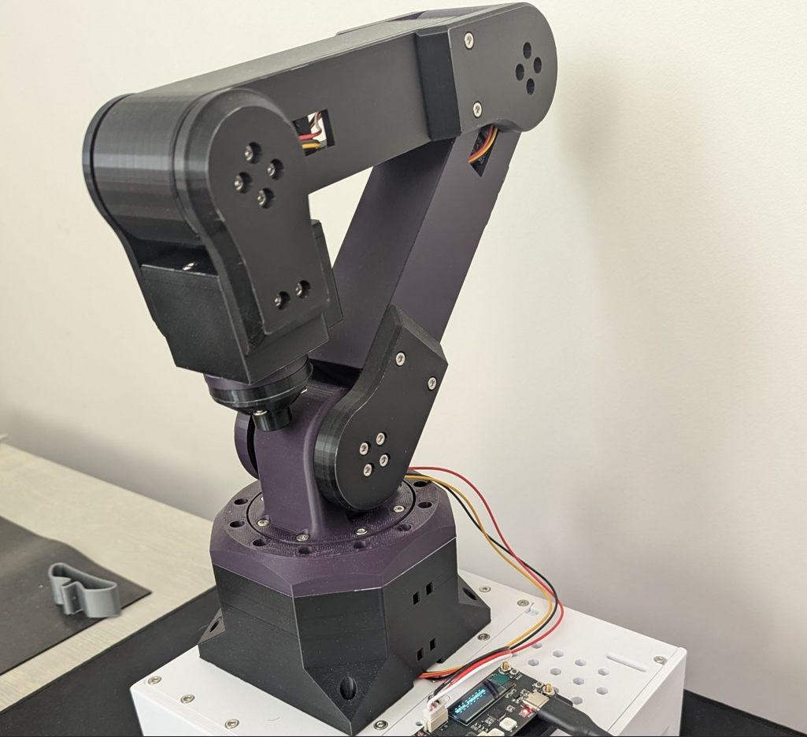
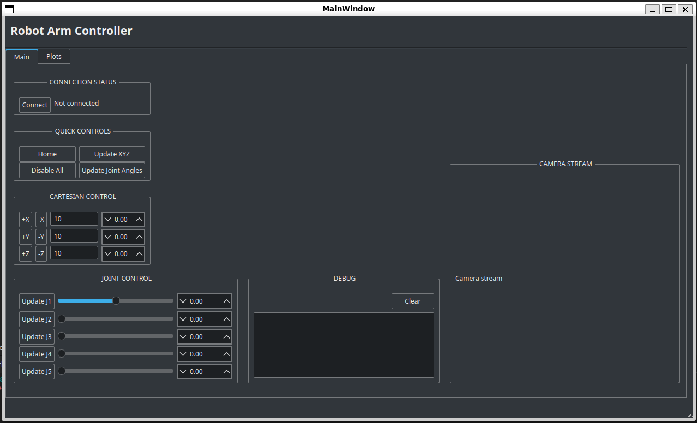

# 5 DOF ROBOT ARM

](assets/robot_arm_1.png)

## Overview
This is a hobby project where I designed and built a custom 5 DOF 3D printed robot arm, as well as a graphical user interface (GUI) to control the robot arm. The purpose is to explore communication protocols, robot kinematics, and learn design patterns (among many other concepts). This project is still very much a work in progress; I have many features in mind.

## Hardware
The robot uses Feetech STS3215 (30kg) serial bus servo motors, which provide more control and feedback than traditional hobby servo motors which often only allow position control (no feedback at all). The serial bus servo motors can be daisy-chained using cables with Molex 5264 connectors, which reduce the amount of wiring clutter. The low-level control of the motors is programmed on an ESP32 module using Feetech's Arduino libraries.  

High-level robot controls are hosted on a Raspberry Pi 4B, while the GUI was developed on Ubuntu in an x86 virtual machine.

## Software  
The Raspberry Pi 4B hosts the following components:
- Socket server
- Message handler
- Protocol parser
- Robot class (high level control library)
- Kinematics class (computation library)
  
The GUI application is written using the Qt framework and designed using Qt Creator. A 3rd part library, breeze, was used for styling.

## High Level Project Architecture - Binary Protocol
I wrote a binary protocol to manage the communication between the Python server and the C++ client via TCP connection. The server and client communicate using streams of byte arrays that contain various pieces of information such as the type of message being sent (`CONNECT`, `HOME`, `DISABLE`, `MOVE_X`, etc.) and the payload (such as Cartesian coordinates or joint angles). They share a common set of definitions that they both understand, which makes this system language-agnostic.

### Global Definitions
- The message type values mirror each other on both the client and server side.
- Both sides expect a byte array "frame" of length 64.

### Robot/Server Side (Python)
- A socket server listens for incoming messages. When messages are received, the socket server continues to accumulate bytes until the buffer is full (64 bytes).
- The message is passed to a `MessageHandler` class, which calls a `decode_message` method from the `ProtocolParser` class to extract the message type and payload, then the `MessageHandler` class calls the `message_handler` method that corresponds to the message type that was received.
- To send messages (such as joint angle feedback and message responses) to the client, an `encode_message` method in the `ProtocolParser` class is used to convert the payload into a byte array

### GUI/Client side (C++)

](assets/GUI_1.png)

- The client uses the same class architecture as the server.
- A `MessageHandler` class is used to route messages based on the message type.
- A `ProtocolParser` for encoding/decoding messages.
- The Qt application uses a signal/slot mechanism to relate user interactions with functions. For example, sending a `HOME` command in the client will also emit a signal to read joint angles, and the GUI will react to this signal by populating/updating the joint angle values displayed in spinboxes.

## Building The Project
1. Clone this repository: `git clone https://github.com/ianhong95/5DOFRobotArmV2`
2. Ensure that Python essentials are installed:  
    `sudo apt update && install python3.12-dev build-essential`
3. Set up Python virtual environment and activate it:  
    `sudo apt update`  
    `sudo apt install python-venv`  
    `python3 -m venv venv`  
    `source venv/bin/activate`  
4. Install dependencies: `python install -r requirements.txt`
5. Give yourself permission to access the serial port (add to dialout group).  
    `sudo usermod -aG dialout your_username`

### Building Qt Development Environment
1. Install basic requirements for Qt:  
    `sudo apt-get install build-essential libgl1-mesa-dev`
2. Install Qt Creator using the online installer for Linux (requires a Qt account):  
    https://doc.qt.io/qt-6/get-and-install-qt.html
3. Go through the installer and make sure to install Qt Creator.
4. The stylesheet `breeze` requires Qt5 dependencies:  
    - `sudo apt install qtbase5-dev qtbase5-dev-tools libqt5svg5-dev`
    - Navigating to the `build` directory, then run:  
        `cmake -DCMAKE_PREFIX_PATH=/usr/lib/x86_64-linux-gnu/cmake/Qt5 ..`
5. Install opencv and rerun cmake:  
    `sudo apt install libopencv-dev`  
    `cmake ..`  
6. Run Qt Creator: `qtcreator &`
7. Click on `Open Project` and open the `CMakeLists.txt` file in the project directory.
8. Go through the rest of the configurations.